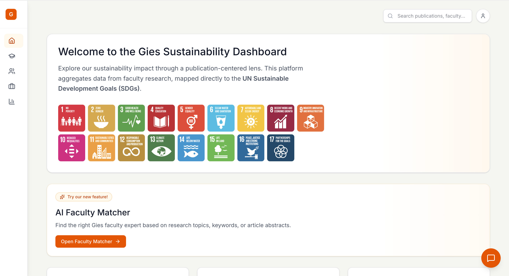

# Dash4Earth 🌍
## Gies Sustainability Intelligence Platform Prototype

This repository contains the prototype developed by **Team Dash4Earth** for the **Gies Case Competition**.

The platform is designed to transform sustainability research into an interactive intelligence system that helps users explore:

- SDG-aligned research topics
- faculty expertise
- academic publications
- industry-oriented sustainability insights

## Links

- **Demo Link:** https://eugenie1708.github.io/case-competition/marketing
- **Prototype Link:** https://eugenie1708.github.io/case-competition/

## What This Prototype Includes

### Sustainability Intelligence Dashboard
A centralized dashboard that organizes sustainability research through SDG mapping and connected insights.

### Faculty Expertise Profiles
Users can explore faculty members whose research aligns with sustainability topics and publications.

### AI Faculty Matcher
A prototype feature that matches faculty experts based on keywords, research topics, or article abstracts.

### Research Explorer
A preview of how research topics, publications, and SDG themes can be connected in one platform.

## Who Benefits

- **Students** — discover research opportunities and faculty mentors
- **Faculty** — increase visibility and find collaboration opportunities
- **Industry** — access academic expertise and sustainability insights
- **Leadership** — gain strategic visibility into sustainability research impact

## About the Project

This prototype was created by **Dash4Earth** for the **Gies Case Competition** to demonstrate how academic sustainability research can be made more discoverable, connected, and actionable.

## License

This repository is for educational and demonstration purposes.